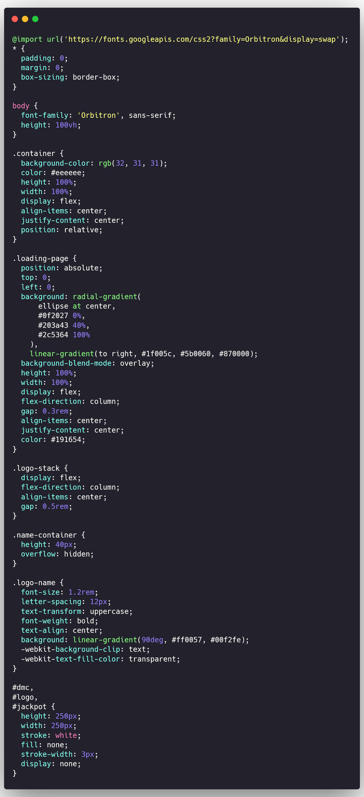
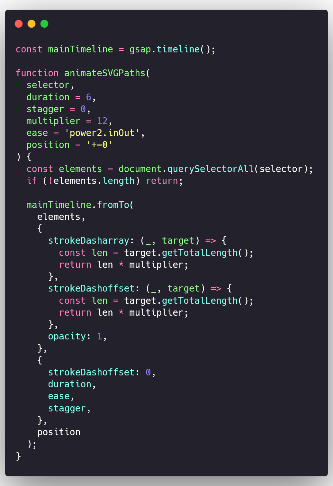
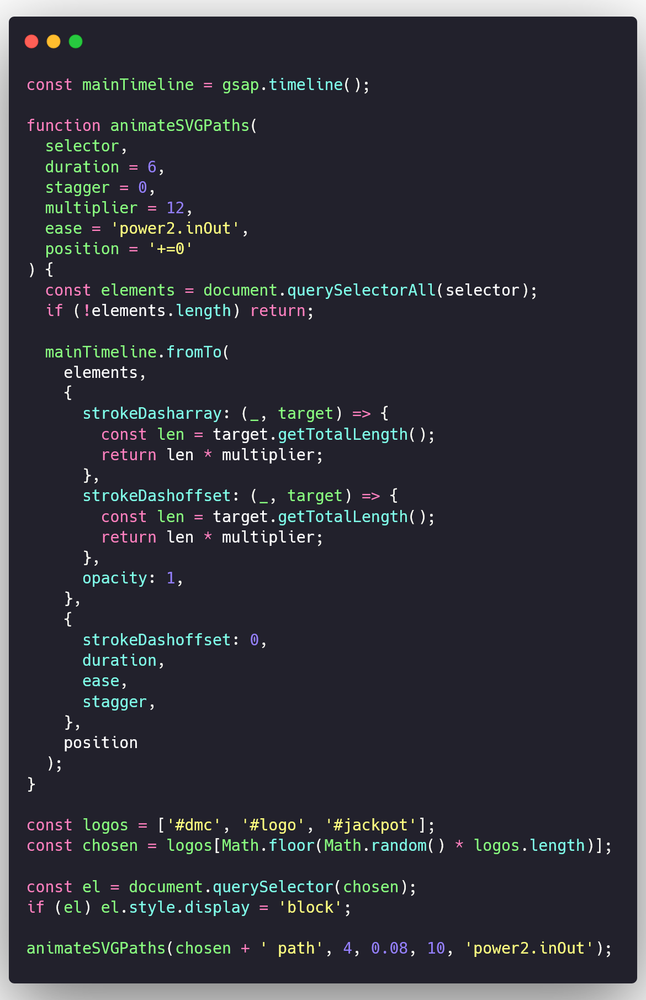

# Cry4Dev - Animated SVG Loader with GSAP

Una animación de carga usando GSAP y SVG. Este proyecto muestra aleatoriamente uno de tres logotipos SVG (Devil May Cry, Jackpot! o Cry4Dev) con un efecto de trazo animado, ofreciendo una experiencia visual impactante antes de revelar el contenido.

## 🚀 Resultado

Cada vez que se recarga la página (F5), se renderiza y anima uno de los SVG seleccionados al azar, seguido por una animación textual con el nombre Cry4Dev y una transición suave hacia el contenido principal.

---

## ▶️ Demo


---

## 🧩 Archivos esenciales

- `index.html`: Estructura principal del documento.
- `style.css`: Estilizado visual y animaciones base.
- `script.js`: Animación, aleatoriedad y control con GSAP.

---

## 📌 Objetivo

Implementar un loader SVG animado que dibuja trazos de manera dinámica con GSAP, alternando entre varios logos, ideal para branding personal, portafolios creativos o interfaces de estilo futurista.

---

## 🛠️ Paso a paso para crear el loader

### 1. Estructura básica en HTML

En el archivo `index.html`, se define un contenedor principal `.container` con el contenido de la web, y una página de carga `.loading-page` con los SVGs animables.
Incluye GSAP vía CDN y tus archivos locales:

```html
<link rel="stylesheet" href="style.css" />
<script src="https://cdn.jsdelivr.net/npm/gsap@3.12.7/dist/gsap.min.js"></script>
<script src="./script.js"></script>
```

Ejemplo de la estructura HTML:

```html
<!DOCTYPE html>
<html lang="en">
  <head>
    <meta charset="UTF-8" />
    <meta http-equiv="X-UA-Compatible" content="IE=edge" />
    <meta name="viewport" content="width=device-width, initial-scale=1.0" />
    <title>Cry4Dev - Loader GSAP</title>
    <link rel="stylesheet" href="style.css" />
  </head>

  <body>
    <!-- Content of the page -->
    <div class="container">
      <span> “Power... I need more power.” </span>
    </div>

    <!-- Loading animation using GSAP -->
    <div class="loading-page">
      <div class="logo-stack">
        <!-- Here are the SVGs -->
      </div>

      <!-- Preloader text -->
      <div class="name-container">
        <div class="logo-name">Cry4Dev</div>
      </div>
    </div>
    <script src="https://cdn.jsdelivr.net/npm/gsap@3.12.7/dist/gsap.min.js"></script>
    <script src="./script.js"></script>
  </body>
</html>
```

<details>
<summary>Ver imagen del HTML</summary>

</details>

### 2. Estilizado del loader (CSS)

En el archivo `style.css`, se definen los estilos básicos para la página de carga y el contenedor principal. Se utiliza una fuente de Google Fonts llamada **Orbitron** para darle un toque futurista.

#### ✨ Detalles visuales

- Gradientes de fondo (`radial + linear`)
- Tipografía retro (`Orbitron`)
- Texto con efecto `clip-path` degradado

```css
@import url('https://fonts.googleapis.com/css2?family=Orbitron&display=swap');
* {
  padding: 0;
  margin: 0;
  box-sizing: border-box;
}

body {
  font-family: 'Orbitron', sans-serif;
  height: 100vh;
}

.container {
  background-color: rgb(32, 31, 31);
  color: #eeeeee;
  height: 100%;
  width: 100%;
  display: flex;
  align-items: center;
  justify-content: center;
  position: relative;
}

.loading-page {
  position: absolute;
  top: 0;
  left: 0;
  background: radial-gradient(
      ellipse at center,
      #0f2027 0%,
      #203a43 40%,
      #2c5364 100%
    ), linear-gradient(to right, #1f005c, #5b0060, #870000);
  background-blend-mode: overlay;
  height: 100%;
  width: 100%;
  display: flex;
  flex-direction: column;
  gap: 0.3rem;
  align-items: center;
  justify-content: center;
  color: #191654;
}

.logo-stack {
  display: flex;
  flex-direction: column;
  align-items: center;
  gap: 0.5rem;
}

.name-container {
  height: 40px;
  overflow: hidden;
}

.logo-name {
  font-size: 1.2rem;
  letter-spacing: 12px;
  text-transform: uppercase;
  font-weight: bold;
  text-align: center;
  background: linear-gradient(90deg, #ff0057, #00f2fe);
  -webkit-background-clip: text;
  -webkit-text-fill-color: transparent;
}
```

<details>
<summary>Ver imagen del CSS</summary>

</details>

### 3. Añadir los SVGs

Añadir los SVGs en el contenedor `.logo-stack` del HTML. Asegúrate de que cada SVG tenga un `id` único para poder seleccionarlos más tarde.

> [!TIP]
> Puedes usar SVGs de alguna librería o crear los tuyos propios con un editor como Figma, Inkscape o Adobe Illustrator.
> Asegúrate de que los SVGs tengan el atributo `stroke` para que la animación de trazo funcione correctamente.

```html
<div class="logo-stack">
  <svg id="dmc" ...></svg>
  <svg id="jackpot" ...></svg>
  <svg id="logo" ...></svg>
</div>
```

<details>
<summary>Ver imagen del HTML</summary>

</details>

### 4. Agregar el CSS para los SVGs

Asegúrate de que los SVGs tengan un tamaño adecuado y estén ocultos por defecto con `display: none;` para que no aparezcan de inmediato.

Añade el siguiente CSS al final del archivo `style.css`:

```css
#dmc,
#logo,
#jackpot {
  height: 250px;
  width: 250px;
  stroke: white;
  fill: none;
  stroke-width: 3px;
  display: none;
}
```

<details>
<summary>Ver imagen del CSS</summary>

</details>

### 5. Crear el archivo `script.js` y agregar la lógica de animación

Crea un archivo `script.js` y crear la función para animar los SVGs y el texto.

En este paso, creamos un `timeline` de GSAP para controlar la secuencia de animaciones. La función `animateSVGPaths` se encargará de animar los trazos de los SVGs.
Explicación de la función `animateSVGPaths`:

- **selector**: Selecciona los elementos SVG que se van a animar.
- **duration**: Duración de la animación en segundos.
- **stagger**: Tiempo de retraso entre cada animación de trazo.
- **multiplier**: Factor que multiplica la longitud total del trazo para la animación.
- **ease**: Tipo de easing para la animación.
- **position**: Posición en la línea de tiempo donde se inicia la animación.

```js
const mainTimeline = gsap.timeline();

function animateSVGPaths(
  selector,
  duration = 6,
  stagger = 0,
  multiplier = 12,
  ease = 'power2.inOut',
  position = '+=0'
) {
  const elements = document.querySelectorAll(selector);
  if (!elements.length) return;

  mainTimeline.fromTo(
    elements,
    {
      strokeDasharray: (_, target) => {
        const len = target.getTotalLength();
        return len * multiplier;
      },
      strokeDashoffset: (_, target) => {
        const len = target.getTotalLength();
        return len * multiplier;
      },
      opacity: 1,
    },
    {
      strokeDashoffset: 0,
      duration,
      ease,
      stagger,
    },
    position
  );
}
```

<details>
<summary>Ver imagen del JavaScript</summary>

</details>

### 6. Añadir la lógica para elegir un SVG aleatorio

Para elegir un SVG aleatorio, creamos un array con los IDs de los SVGs y seleccionamos uno al azar. Luego, mostramos el SVG seleccionado cambiando su estilo a `display: block;` y llamamos a la función `animateSVGPaths` para animar el trazo.

```js
const logos = ['#dmc', '#logo', '#jackpot'];
const chosen = logos[Math.floor(Math.random() * logos.length)];

const el = document.querySelector(chosen);
if (el) el.style.display = 'block';

animateSVGPaths(chosen + ' path', 4, 0.08, 10, 'power2.inOut');
```

<details>
<summary>Ver imagen del JavaScript</summary>

</details>

### 7. Mostrar el texto "Cry4Dev" con animación

Después de que el SVG se haya dibujado, animamos el texto "Cry4Dev" usando GSAP. La animación consiste en mover el texto hacia arriba y aumentar su opacidad usando `fromTo`.

```js
if (document.querySelector('.logo-name')) {
  mainTimeline.fromTo(
    '.logo-name',
    { y: 50, opacity: 0 },
    { y: 0, opacity: 1, duration: 1.2, ease: 'power2.out' },
    '<+=0.8'
  );
}
```

<details>
<summary>Ver imagen del JavaScript</summary>

</details>

### 8. Ocultar el loader y mostrar el contenido real

Finalmente, ocultamos la página de carga y mostramos el contenido real. Usamos `onComplete` para asegurarnos de que la animación se complete antes de ocultar el loader.

```js
const loadingPage = document.querySelector('.loading-page');
if (loadingPage) {
  mainTimeline.to(
    loadingPage,
    {
      opacity: 0,
      duration: 1,
      delay: 0.2,
      onComplete: () => {
        loadingPage.classList.add('hidden');
        loadingPage.setAttribute('aria-hidden', 'true');
      },
    },
    '-=2'
  );
}
```

<details>
<summary>Ver imagen del JavaScript</summary>

</details>

---

## 🧠 Siguientes pasos sugeridos

- Añadir almacenamiento local `localStorage` para que el loader sólo se muestre la primera vez.
- Hacer que el texto cambie con frases aleatorias como “Welcome to Cry4Dev”, “Power... I need more power”, etc.

---

## 👤 Autor

**Adán Pérez**  
GitHub: [@Adan-Perez](https://github.com/Adan-Perez)

Este proyecto fue desarrollado como práctica creativa combinando animación SVG, GSAP y JavaScript. La idea es ofrecer una experiencia de carga atractiva y moderna para cualquier sitio web o aplicación.
