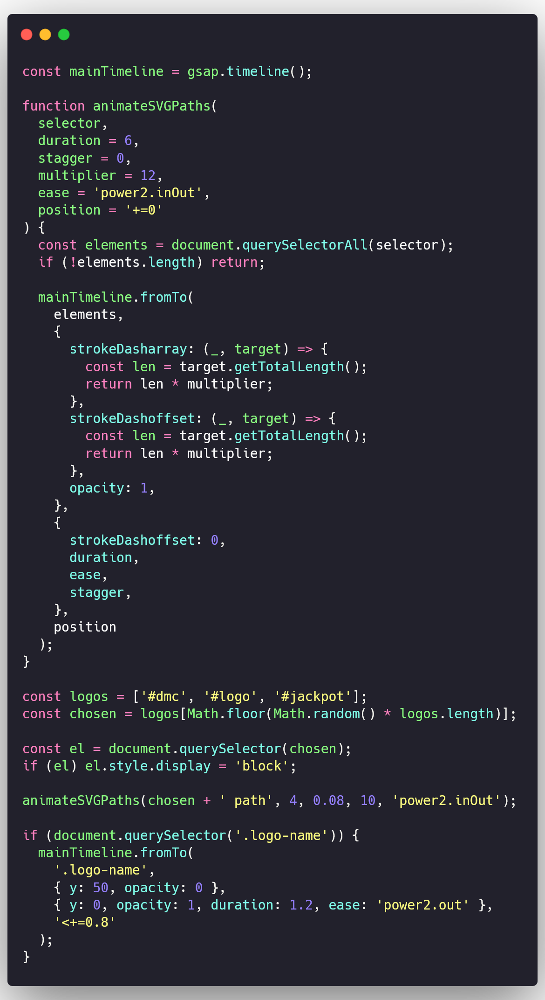
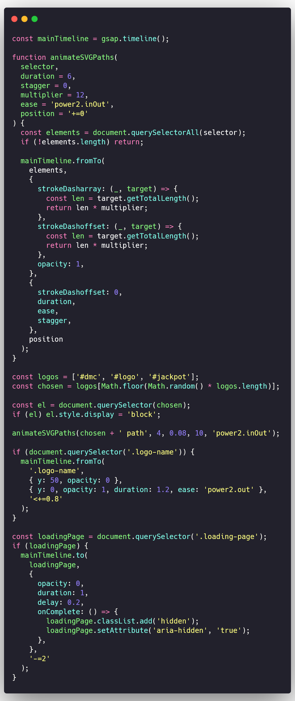

# Cry4Dev - Animated SVG Loader with GSAP

A loading animation using GSAP and SVG. This project randomly displays one of three SVG logos (Devil May Cry, Jackpot! or Cry4Dev) with an animated stroke effect, offering a striking visual experience before revealing the content.

## 🚀 Result

Each time the page is reloaded (F5), one of the randomly selected SVGs is rendered and animated, followed by a text animation with the name Cry4Dev and a smooth transition to the main content.

---

## ▶️ Demo Video

<video
autoplay
muted
loop
playsinline
preload="auto" 
width="600" height="400">

<source src="video/demo.mp4" type="video/mp4">
Your browser does not support the video.
</video>

---

## 🧩 Essential Files

- `index.html`: Main document structure.
- `style.css`: Visual styling and base animations.
- `script.js`: Animation, randomness and control with GSAP.

---

## 📌 Objective

Implement an animated SVG loader that draws strokes dynamically with GSAP, alternating between various logos, ideal for personal branding, creative portfolios or futuristic interfaces.

---

## 🛠️ Step by Step to Create the Loader

### 1. Basic HTML Structure

In the `index.html` file, define a main container `.container` with the web content, and a loading page `.loading-page` with the animatable SVGs.
Include GSAP via CDN and your local files:

```html
<link rel="stylesheet" href="style.css" />
<script src="https://cdn.jsdelivr.net/npm/gsap@3.12.7/dist/gsap.min.js"></script>
<script src="./script.js"></script>
```

Example of the HTML structure:

```html
<!DOCTYPE html>
<html lang="en">
  <head>
    <meta charset="UTF-8" />
    <meta http-equiv="X-UA-Compatible" content="IE=edge" />
    <meta name="viewport" content="width=device-width, initial-scale=1.0" />
    <title>Cry4Dev - Loader GSAP</title>
    <link rel="stylesheet" href="style.css" />
  </head>

  <body>
    <!-- Content of the page -->
    <div class="container">
      <span> "Power... I need more power." </span>
    </div>

    <!-- Loading animation using GSAP -->
    <div class="loading-page">
      <div class="logo-stack">
        <!-- Here are the SVGs -->
      </div>

      <!-- Preloader text -->
      <div class="name-container">
        <div class="logo-name">Cry4Dev</div>
      </div>
    </div>
    <script src="https://cdn.jsdelivr.net/npm/gsap@3.12.7/dist/gsap.min.js"></script>
    <script src="./script.js"></script>
  </body>
</html>
```

<details>
<summary>View HTML image</summary>

</details>

### 2. Styling the Loader (CSS)

In the `style.css` file, define the basic styles for the loading page and the main container. A Google Font called **Orbitron** is used to give it a futuristic touch.

#### ✨ Visual Details

- Background gradients (`radial + linear`)
- Retro typography (`Orbitron`)
- Text with gradient `clip-path` effect

```css
@import url('https://fonts.googleapis.com/css2?family=Orbitron&display=swap');
* {
  padding: 0;
  margin: 0;
  box-sizing: border-box;
}

body {
  font-family: 'Orbitron', sans-serif;
  height: 100vh;
}

.container {
  background-color: rgb(32, 31, 31);
  color: #eeeeee;
  height: 100%;
  width: 100%;
  display: flex;
  align-items: center;
  justify-content: center;
  position: relative;
}

.loading-page {
  position: absolute;
  top: 0;
  left: 0;
  background: radial-gradient(
      ellipse at center,
      #0f2027 0%,
      #203a43 40%,
      #2c5364 100%
    ), linear-gradient(to right, #1f005c, #5b0060, #870000);
  background-blend-mode: overlay;
  height: 100%;
  width: 100%;
  display: flex;
  flex-direction: column;
  gap: 0.3rem;
  align-items: center;
  justify-content: center;
  color: #191654;
}

.logo-stack {
  display: flex;
  flex-direction: column;
  align-items: center;
  gap: 0.5rem;
}

.name-container {
  height: 40px;
  overflow: hidden;
}

.logo-name {
  font-size: 1.2rem;
  letter-spacing: 12px;
  text-transform: uppercase;
  font-weight: bold;
  text-align: center;
  background: linear-gradient(90deg, #ff0057, #00f2fe);
  -webkit-background-clip: text;
  -webkit-text-fill-color: transparent;
}
```

<details>
<summary>View CSS image</summary>

</details>

### 3. Adding the SVGs

Add the SVGs to the `.logo-stack` container in HTML. Make sure each SVG has a unique `id` so you can select them later.

> [!TIP]
> You can use SVGs from a library or create your own with an editor like Figma, Inkscape or Adobe Illustrator.
> Make sure the SVGs have the `stroke` attribute for the stroke animation to work correctly.

```html
<div class="logo-stack">
  <svg id="dmc" ...></svg>
  <svg id="jackpot" ...></svg>
  <svg id="logo" ...></svg>
</div>
```

<details>
<summary>View HTML image</summary>

</details>

### 4. Adding CSS for SVGs

Make sure the SVGs have an appropriate size and are hidden by default with `display: none;` so they don't appear immediately.

Add the following CSS at the end of the `style.css` file:

```css
#dmc,
#logo,
#jackpot {
  height: 250px;
  width: 250px;
  stroke: white;
  fill: none;
  stroke-width: 3px;
  display: none;
}
```

<details>
<summary>View CSS image</summary>

</details>

### 5. Creating the `script.js` File and Adding Animation Logic

Create a `script.js` file and create the function to animate the SVGs and text.

In this step, we create a GSAP `timeline` to control the animation sequence. The `animateSVGPaths` function will handle animating the SVG strokes.
Explanation of the `animateSVGPaths` function:

- **selector**: Selects the SVG elements to be animated.
- **duration**: Duration of the animation in seconds.
- **stagger**: Delay time between each stroke animation.
- **multiplier**: Factor that multiplies the total stroke length for the animation.
- **ease**: Type of easing for the animation.
- **position**: Position in the timeline where the animation starts.

```js
const mainTimeline = gsap.timeline();

function animateSVGPaths(
  selector,
  duration = 6,
  stagger = 0,
  multiplier = 12,
  ease = 'power2.inOut',
  position = '+=0'
) {
  const elements = document.querySelectorAll(selector);
  if (!elements.length) return;

  mainTimeline.fromTo(
    elements,
    {
      strokeDasharray: (_, target) => {
        const len = target.getTotalLength();
        return len * multiplier;
      },
      strokeDashoffset: (_, target) => {
        const len = target.getTotalLength();
        return len * multiplier;
      },
      opacity: 1,
    },
    {
      strokeDashoffset: 0,
      duration,
      ease,
      stagger,
    },
    position
  );
}
```

<details>
<summary>View JavaScript image</summary>

</details>

### 6. Adding Logic to Choose a Random SVG

To choose a random SVG, we create an array with the SVG IDs and select one at random. Then, we display the selected SVG by changing its style to `display: block;` and call the `animateSVGPaths` function to animate the stroke.

```js
const logos = ['#dmc', '#logo', '#jackpot'];
const chosen = logos[Math.floor(Math.random() * logos.length)];

const el = document.querySelector(chosen);
if (el) el.style.display = 'block';

animateSVGPaths(chosen + ' path', 4, 0.08, 10, 'power2.inOut');
```

<details>
<summary>View JavaScript image</summary>

</details>

### 7. Displaying the "Cry4Dev" Text with Animation

After the SVG has been drawn, we animate the "Cry4Dev" text using GSAP. The animation consists of moving the text upwards and increasing its opacity using `fromTo`.

```js
if (document.querySelector('.logo-name')) {
  mainTimeline.fromTo(
    '.logo-name',
    { y: 50, opacity: 0 },
    { y: 0, opacity: 1, duration: 1.2, ease: 'power2.out' },
    '<+=0.8'
  );
}
```

<details>
<summary>View JavaScript image</summary>

</details>

### 8. Hiding the Loader and Showing the Real Content

Finally, we hide the loading page and show the real content. We use `onComplete` to ensure that the animation completes before hiding the loader.

```js
const loadingPage = document.querySelector('.loading-page');
if (loadingPage) {
  mainTimeline.to(
    loadingPage,
    {
      opacity: 0,
      duration: 1,
      delay: 0.2,
      onComplete: () => {
        loadingPage.classList.add('hidden');
        loadingPage.setAttribute('aria-hidden', 'true');
      },
    },
    '-=2'
  );
}
```

<details>
<summary>View JavaScript image</summary>

</details>

---

## 🧠 Suggested Next Steps

- Add local storage `localStorage` so the loader only shows the first time.
- Make the text change with random phrases like "Welcome to Cry4Dev", "Power... I need more power", etc.

---

## 👤 Author

**Adán Pérez**  
GitHub: [@Adan-Perez](https://github.com/Adan-Perez)

This project was developed as a creative practice combining SVG animation, GSAP and JavaScript. The idea is to provide an attractive and modern loading experience for any website or application.
